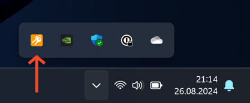
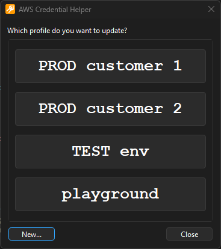

# AWS Credential Helper

This is a small Windows tool (toy?) for me and my colleagues to ease up the task of having to frequently update various profiles in our `~/.aws/credentials` files. This tool lives in your systray:



 It monitors your clipboard for text that matches AWS credentials like this:

```plain
[default]
aws_access_key_id=bla
aws_secret_access_key=foo
aws_session_token=bar
```

If it find credentials, it shows a dialog like this:



It will be pre-populated with (huge) buttons of your existing profiles, so you can update a profile with one click. And that's it, no bells or whistles of any kind 😉.

You can left-click the tray icon to open that same dialog, but it will be in read-only mode where you cannot click anything besides the `Close` button.

You can right-click the tray icon to open a menu where you can quit the app.

Created using the excellent [Qt Framework](https://www.qt.io/development/qt-framework).

## download

Downloads for Windows are available in the [Releases](https://github.com/dehesselle/awscred/releases) section.

## license

This work is licensed under [`GPL-2.0-or-later`](LICENSE).  
Using [Leksys' INI Parser](https://github.com/Lek-sys/LeksysINI) licensed under [`MIT`](https://github.com/Lek-sys/LeksysINI/blob/69a2ad1/LICENSE).
