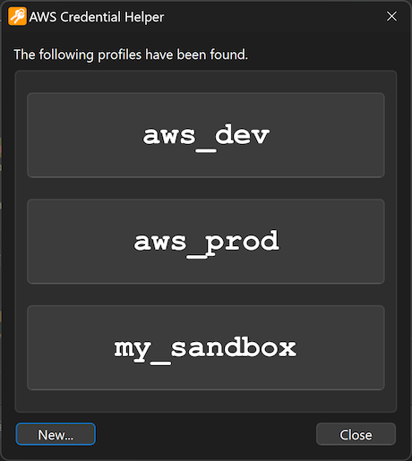

# AWS Credential Helper

This is a small tool (toy?) for me and my colleagues to ease up the task of having to frequently update various profiles in our `~/.aws/credential` files. This tool lives in your systray


 and watches your clipboard for AWS credentials in the form of

```plain
[default]
aws_access_key_id=bla
aws_secret_access_key=foo
aws_session_token=bar
```

and pops up a dialog like this:



It will be pre-populated with buttons of your existing profiles, so you can update a profile with one click. And that's it, no bells or whistles of any kind 😉.

While this has been created with the excellent [Qt Framework & Development Tools](https://www.qt.io) and is cross-platform, it is specifically targeted at Windows.

## download

Downloads for Windows are available in the [Releases](https://github.com/dehesselle/awscred/releases) section.

## license

This work is licensed under [`GPL-2.0-or-later`](LICENSE).  
Using [Leksys' INI Parser](https://github.com/Lek-sys/LeksysINI) licensed under [`MIT`](https://github.com/Lek-sys/LeksysINI/blob/69a2ad1/LICENSE).
